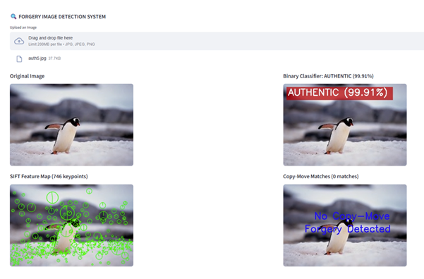
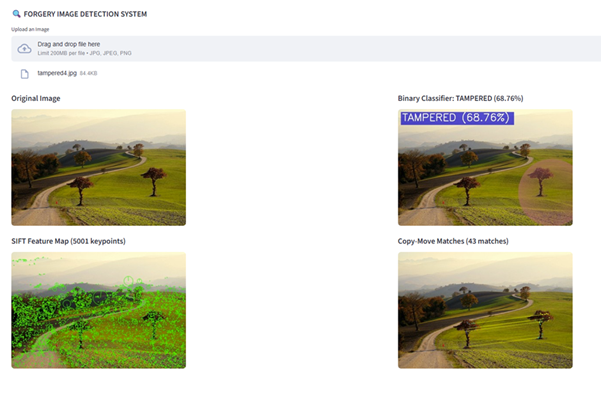

<h1>FORGERY IMAGE DETECTION SYSTEM</h1>
<b>ABSTRACT  </b>

This project is about detecting whether an image is real or edited. We use three methods together to make the detection more accurate. First, a deep learning model checks if the image is tampered. Then, Grad-CAM highlights the areas where the model thinks editing has happened. Next, SIFT finds important keypoints in the image to understand its structure. Finally, a Copy-Move detection method checks if any part of the image has been copied and pasted somewhere else. By combining these techniques, our system can detect different types of forgery such as splicing, copy-move, and region editing. The project provides clear visual results like heatmaps, keypoints, and matched regions. It works through a simple Streamlit interface for easy use. This helps users quickly identify manipulated images in a reliable and understandable way.
 

<table border="0" cellspacing="0" cellpadding="6">
  <tr>
    <th align="center"><b>Name</b></th>
    <th align="center"><b>Register Number</b></th>
  </tr>
  <tr>
    <td>ABRAHAM JUSTIN</td>
    <td align="center">23MIA1027</td>
  </tr>
  <tr>
    <td>VENKATARAMAN R</td>
    <td align="center">23MIA1025</td>
  </tr>
  <tr>
    <td>SUDARSHAN MANIKANDAN</td>
    <td align="center">23MIA1078</td>
  </tr>
</table>

<b>BASE PAPER REFERENCE  </b>
Title: An Effective Image Copy-Move Forgery Detection Using Entropy Information  
Authors: Li Jiang, Zhaowei Lu  
Publisher: IEEE  
Year: 2024  
Link: <a href="An_Effective_Image_Copy-Move_Forgery_Detection_Using_Entropy_Information.pdf">Base Paper</a>  
 

<b>TOOLS AND LIBRARIES USED  </b>
<ul>  
<li>Python 3.8+</li> 
<li>PyTorch</li>   
<li>OpenCV</li>   
<li>NumPy </li>  
<li>Matplotlib</li>   
<li>Streamlit</li>  
<li>scikit-image</li>   
<li>torchvision</li>  
<li>SIFT / ORB keypoint extractors</li> 
<li>Machine Learning Model (EfficientNet-B0) </li>  
<li>Grad-CAM visualization</li> 
<li>glob, os, uuid libraries</li> 
</ul>  

<b>STEPS TO EXECUTE THE CODE  </b>
A) Streamlit App
1.	Open terminal
2.	Navigate to project folder
3.	cd project/src
4.	Run Streamlit
5.	streamlit run app.py
6.	Upload an image
7.	The system displays:  
	    Original image  
	    Grad-CAM heatmap  
	    SIFT keypoint visualization  
	    Copy-Move detection result  
	    Summary panel  

B) Console Version  
1.	Navigate to src/
2.	Run:
3.	python main_integrated.py
4.	Enter image path
5.	All results are saved inside results/ folder.

<b>DESCRIPTION OF DATASET  </b>

The dataset used for training includes tampered and authentic images collected from publicly available sources such as CASIA v2.0 Dataset. These datasets contain images manipulated through splicing, copy-move, object removal, and region editing. Each image is labeled as either tampered or authentic, enabling supervised training of the binary classifier. The dataset includes a variety of image categories (indoor, outdoor, objects, people) ensuring generalization across diverse manipulation types.
 

<b>OUTPUT SCREENSHOTS   </b>

The system provides the following outputs: 

 
  

 

<b>YouTube Demo Link:</b> https://youtu.be/H1L5Xe34UgU 

